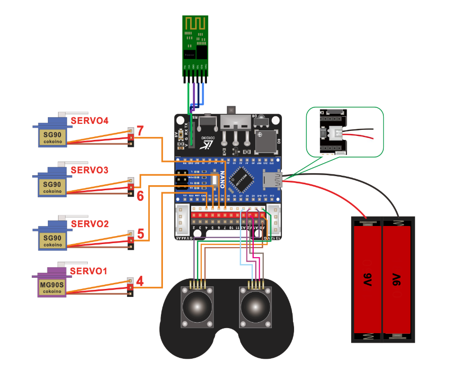
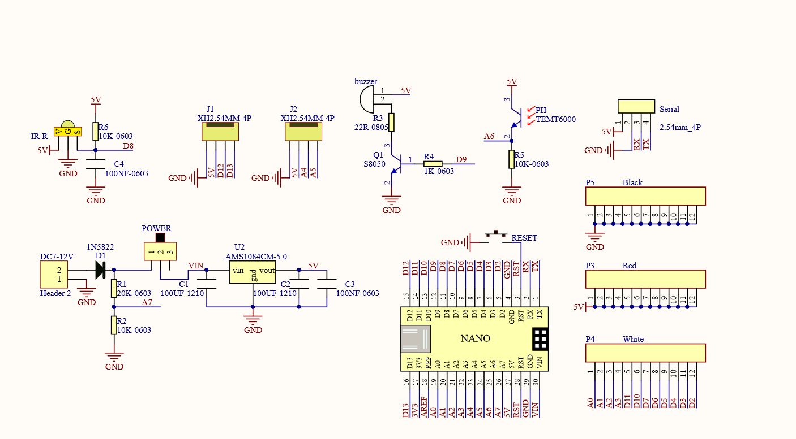

# Phone-Controlled Robotic Arm
Replace this text with a brief description (2-3 sentences) of your project. This description should draw the reader in and make them interested in what you've built. You can include what the biggest challenges, takeaways, and triumphs from completing the project were. As you complete your portfolio, remember your audience is less familiar than you are with all that your project entails!

```HTML
```

| **Engineer** | **School** | **Area of Interest** | **Grade** |
|:--:|:--:|:--:|:--:|
| Abhi M | Saint Francis High School | Mechanical Engineering and Computer Science | Incoming Senior

<!--

**Replace the BlueStamp logo below with an image of yourself and your completed project. Follow the guide [here](https://tomcam.github.io/least-github-pages/adding-images-github-pages-site.html) if you need help.**


# Final Milestone

**Don't forget to replace the text below with the embedding for your milestone video. Go to Youtube, click Share -> Embed, and copy and paste the code to replace what's below.**

<iframe width="560" height="315" src="https://www.youtube.com/embed/F7M7imOVGug" title="YouTube video player" frameborder="0" allow="accelerometer; autoplay; clipboard-write; encrypted-media; gyroscope; picture-in-picture; web-share" allowfullscreen></iframe>

For your final milestone, explain the outcome of your project. Key details to include are:
- What you've accomplished since your previous milestone
- What your biggest challenges and triumphs were at BSE
- A summary of key topics you learned about
- What you hope to learn in the future after everything you've learned at BSE


# Second Milestone

**Don't forget to replace the text below with the embedding for your milestone video. Go to Youtube, click Share -> Embed, and copy and paste the code to replace what's below.**

<iframe width="560" height="315" src="https://www.youtube.com/embed/y3VAmNlER5Y" title="YouTube video player" frameborder="0" allow="accelerometer; autoplay; clipboard-write; encrypted-media; gyroscope; picture-in-picture; web-share" allowfullscreen></iframe>

For your second milestone, explain what you've worked on since your previous milestone. You can highlight:
- Technical details of what you've accomplished and how they contribute to the final goal
- What has been surprising about the project so far
- Previous challenges you faced that you overcame
- What needs to be completed before your final milestone 

-->

# First Milestone

<iframe width="560" height="315" src="https://www.youtube.com/embed/8FWRxd0kS98?si=ZkONE2Y5-EbJ_WSX" title="YouTube video player" frameborder="0" allow="accelerometer; autoplay; clipboard-write; encrypted-media; gyroscope; picture-in-picture; web-share" referrerpolicy="strict-origin-when-cross-origin" allowfullscreen></iframe>

My project is a phone-controlled robotic arm. The assembly consists of three primary parts: the power source, the Arduino Nano board, and the robotic arm itself. For the power source, I used 5 standard Double-A batteries, that were 1.5 volts each. Because I had to use a different power source than what the default was, I had to solder a couple of the wires from the battery holder to the Arduino Nano.

I had 2 major challenges throughout this phase of the project, the first one being the change in battery source. I had to improvise with 5, 1.5-volt, Double-A batteries rather than using 3.7-volt batteries. The other challenge was that the base of the robotic arm being unstable. This was such a critical problem because it was impairing the performance of the servos, and ultimately, the whole arm, since the servos are entirely responsible for the mobility of the arm in the first place. I decided to hot glue the base for overall stability, and it worked really well. Because the base was sturdy, it'd only make sense that the 

<!--
For your first milestone, describe what your project is and how you build it. You can include:
- An explanation about the different components of your project and how they will all integrate together
- Technical progress you've made so far
- Challenges you're facing and solving in your future milestones
- What your plan is to complete your project

-->

# Schematics




# Code

```c++
// Arduino Starter Project Code

#define LED_PIN 8
#define BUTTON_PIN 7
void setup() {
  pinMode(LED_PIN, OUTPUT);
  pinMode(BUTTON_PIN, INPUT);
}
void loop() {
  if (digitalRead(BUTTON_PIN) == HIGH) {
    digitalWrite(LED_PIN, HIGH);
  }
  else {
    digitalWrite(LED_PIN, LOW);
  }

}
```


# Bill of Materials

| **Part** | **Note** | **Price** | **Link** |
|:--:|:--:|:--:|:--:|
| Arduino Uno R3 | What the item is used for | $24.50 | <a href="https://www.amazon.com/Arduino-A000066-ARDUINO-UNO-R3/dp/B008GRTSV6/"> Link </a> |
| HC-05 Bluetooth Module | What the item is used for | $10.39 | <a href="[https://www.amazon.com/Arduino-A000066-ARDUINO-UNO-R3/dp/B008GRTSV6/](https://www.amazon.com/HiLetgo-Wireless-Bluetooth-Transceiver-Arduino/dp/B071YJG8DR)"> Link </a> |
| SG90 Servos | What the item is used for | $16.95	 | <a href="[https://www.amazon.com/Arduino-A000066-ARDUINO-UNO-R3/dp/B008GRTSV6/](https://www.amazon.com/American-Robotic-Supply-Authentic-Digital/dp/B0783NS32R/ref=sr_1_4?keywords=tower+pro+sg90&qid=1689780732&sr=8-4)"> Link </a> |
| MG90 Servos | What the item is used for | $10.99 | <a href="[https://www.amazon.com/Arduino-A000066-ARDUINO-UNO-R3/dp/B008GRTSV6/](https://www.amazon.com/MG90S-Servo-Motor-Helicopter-Arduino/dp/B07L6FZVT1?th=1)"> Link </a> |
| 9V Batteries | What the item is used for | $6.58 | <a href="[https://www.amazon.com/Arduino-A000066-ARDUINO-UNO-R3/dp/B008GRTSV6/](https://www.amazon.com/Energizer-Alkaline-General-Purpose-Battery/dp/B00003IE4E)"> Link </a> |
| JST Battery Connectors | What the item is used for | $8.99 | <a href="[https://www.amazon.com/Arduino-A000066-ARDUINO-UNO-R3/dp/B008GRTSV6/](https://www.amazon.com/daier-Micro-2-Pin-Connector-Female/dp/B01DUC1O68)"> Link </a> |
| 9V Battery Clips | What the item is used for | $5.99 | <a href="https://www.amazon.com/Arduino-A000066-ARDUINO-UNO-R3/dp/B008GRTSV6/"> Link </a> |
| Female to Female Connectors | What the item is used for | $6.98 | <a href="[https://www.amazon.com/Arduino-A000066-ARDUINO-UNO-R3/dp/B008GRTSV6/](https://www.amazon.com/EDGELEC-Breadboard-1pin-1pin-Connector-Multicolored/dp/B07GD312VG/ref=sr_1_4?crid=11X4PIA5EMMZO&keywords=female+to+female+connectors&qid=1689781475&s=industrial&sprefix=female+to+female+connector%2Cindustrial%2C150&sr=1-4)"> Link </a> |

# Starter Project - Arduino

<iframe width="560" height="315" src="https://www.youtube.com/embed/Ouj8QiF5I10?si=J2NXSLYyQtNMBuv3" title="YouTube video player" frameborder="0" allow="accelerometer; autoplay; clipboard-write; encrypted-media; gyroscope; picture-in-picture; web-share" referrerpolicy="strict-origin-when-cross-origin" allowfullscreen></iframe>

For my starter project, I chose the Arduino kit because it felt relevant to my interests in mechanical and electrical engineering. Moreover, my main project, the Phone-Controlled Robotic Arm, uses Arduino components. In turn, I believed it would be a good investment to touch up on my Arduino basics. This was a good choice because I got lots of soldering practice along the way too. The Arduino is connected to a breadboard through wires allowing for electrical flow. The input on the breadboard was a button, and the output was an LED. The power came from a 5V source on the Arduino board. 
The code was fairly simple. All it was was an if-else loop that took whether the button was pressed as the input. If it was, then it would turn the LED on in response. If not, it would leave it in its default state, turned off. 

# References
- https://roboticsbackend.com/arduino-turn-led-on-and-off-with-button/
- https://www.youtube.com/watch?v=fq5VMYeWftI&t=3s&ab_channel=StarHive

