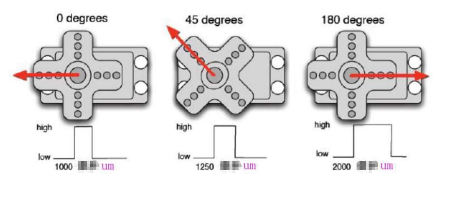
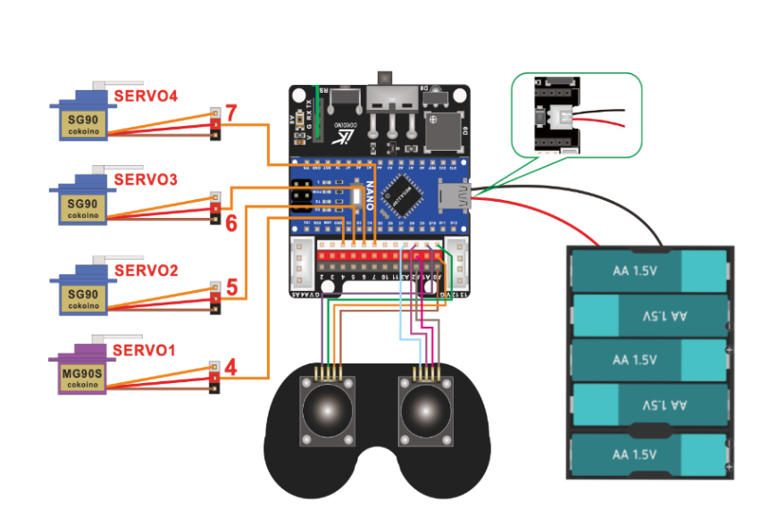
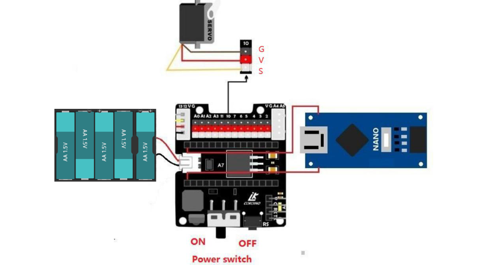
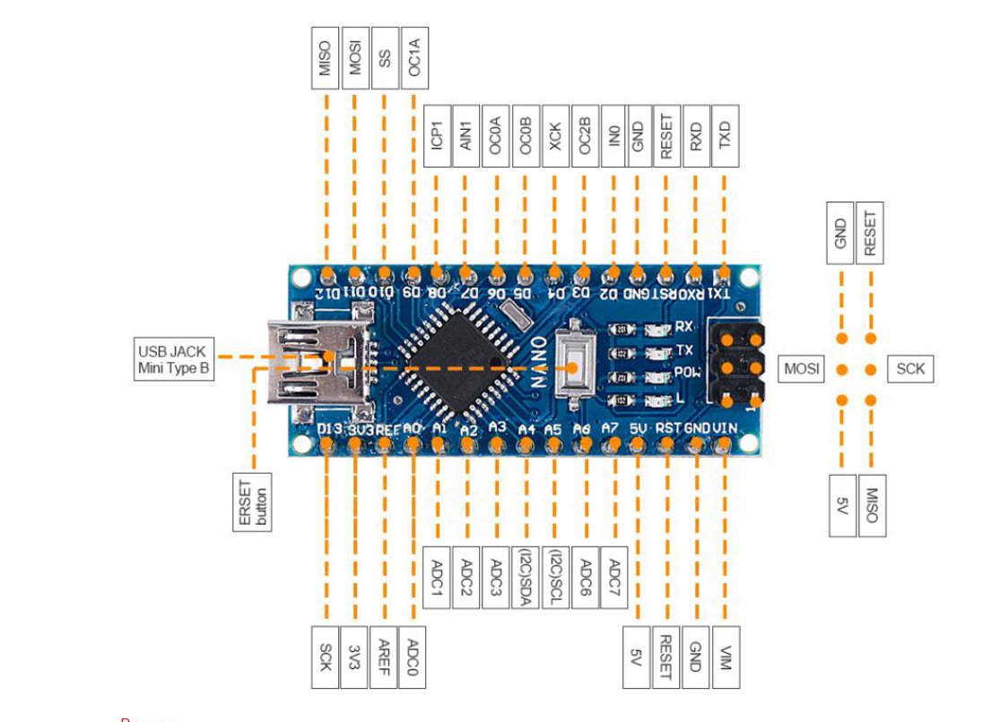

# Muscle-Controlled Robotic Arm: Electromyography Interface

Electromyography...but what exactly does that mean? It is the visual or audible representation of electrical signals that come from muscle stimulation. And how exactly can we detect and read these signals? Electrodes placed on the skin are responsible for converting bioelectrical signals from the muscles into electrical signals ready to be read and processed. In a nutshell, this information goes to a microprocessor, which then tells a robotic arm what part, and how much, to move. 

<!--
Replace this text with a brief description (2-3 sentences) of your project. This description should draw the reader in and make them interested in what you've built. You can include what the biggest challenges, takeaways, and triumphs from completing the project were. As you complete your portfolio, remember your audience is less familiar than you are with all that your project entails!
-->

```HTML
```

| **Engineer** | **School** | **Area of Interest** | **Grade** |
|:--:|:--:|:--:|:--:|
| Abhi M | Saint Francis High School | Mechanical Engineering and Computer Science | Incoming Senior

<p align = "center">
 
</p>

<!--
# Final Milestone


For your final milestone, explain the outcome of your project. Key details to include are:
- What you've accomplished since your previous milestone
- What your biggest challenges and triumphs were at BSE
- A summary of key topics you learned about
- What you hope to learn in the future after everything you've learned at BSE
-->

# Final Milestone

*Video coming soon


For the last step of my project, there happened to be a shift in the primary focus. The final modification of my project consists of making the robotic arm controlled through human muscle contractions, rather than through an app on a phone. There are 3 new parts that I am using for this part of the project: electrodes, the electromyography (EMG) sensor module, and snap electrode cables. The entire idea is that the user will be able to manipulate the different servos on the robotic arm by contracting certain muscles in their forearm. For this to effectively happen, all the 3 new parts play an important role. The electrodes are connected to the user's forearm, and their job is to take the bioelectrical signals received from the muscle and convert them to electrical signals. They then send these signals to the EMG sensor module through the snap electrode cables. The role of the EMG module is to detect, amplify, and process these electrical signals. Once it has done so, it sends the input to the Arduino board for further processing. Based on the input that the Arduino receives, it decides what servo should move, and by how much.

Overall, my biggest challenge for this project was exploring concepts outside my comfort zone. I had to use lots of patience and troubleshooting strategies when procedures did not go as planned. Some of these approaches included revisiting code, rewiring electrical circuits, and taking apart and putting back together mechanical parts for better functionality and efficiency (specifically the servos). Some of my biggest triumphs included finishing the mechanical and electrical assembly of the robotic arm, writing the servo code from scratch, and integrating an electromyographic system to potentially make the project more engaging for  users. 

Some of the key things I learned about throughout my project include Arduino and circuits (resistance, inductors, impedance, etc.), CAD, HTML, how to make a build-plan and effectively execute and adapt whenever something goes wrong, electromyography and how useful certain instances of it can be in the real world, and the prototyping process. 

For the next step in my engineering journey, I would like to explore similar areas in robotics dealing with mechanical systems and their effect(s) on real-world problems. I believe practical applications are one of the most important things because the whole point of learning new concepts in engineering is being able to implement them in a real-world system to help better the status quo. I am actively looking for ways to implement what I have learned throughout the course of my engineering project to better my community. 

# Second Milestone

<iframe width="560" height="315" src="https://www.youtube.com/embed/Bqi_ROTRROU?si=08SNxCazZwiXQV6R" title="YouTube video player" frameborder="0" allow="accelerometer; autoplay; clipboard-write; encrypted-media; gyroscope; picture-in-picture; web-share" referrerpolicy="strict-origin-when-cross-origin" allowfullscreen></iframe>


The second milestone of my project was primarily focused on the software aspect of my project. The full mechanical frame of the robot had been assembled in the previous milestone, and now all that was left was to give it specific instructions on what to do and how to act when inputs were received. My code consisted of 3 main functions: the setup, the ongoing loop, and the scaleJoyStick function, which I will elaborate on. 

The setup happens at the very start and is used to calibrate the robotic arm so that it is ready to start receiving inputs from the remote control. The setup itself is further divided into two main parts. The first part involves identifying what servos are connected to what digital inputs on the Arduino. Digital inputs can hold only 1 value: true or false, or 1 or 0 respectively. If the current value stored is a 1, it means that the remote control has prompted the servo, and it is currently using all 5 volts. If a 0 is stored, which is the default value, it means that the servo has not been prompted by the remote control, and is not moving. The second part of the setup function tells the robotic arm that, when it is turned on, all servos have to be set to their default position, which is at 90 degrees. The way that servos work is that they have a range of motion from 0 to 180 degrees. 90 degrees set them right in the middle, so they have an equal variability of motion in either direction. 

The next function, the ongoing loop, is the primary part of the code. If the joystick is moved, it reads the analog input based on how hard it is pressed in a particular direction. Analog inputs differ from digital inputs in the sense that, instead of just true or false, they can hold a value from a range of values. In this particular case, the Arduino receives a value from 0 to 1023 inclusive, which is a total of 1024 values, or 2 to the 10th power: the maximum amount that an 8-bit number can hold. But because the number that we want has to be in the range from 0-180, it scales the 0-1023 value down to a 0-180 value. Next, it branches off in 1 of 2 cases. If the particular servo prompted is already at 0 or 180 degrees, and the user wants to move further down in that particular direction, the servo physically cannot, because its variability in range of motion is only from 0-180 degrees. So if it is already at one end of the scale, the code does nothing with the input. In the case that the servo has not reached its minimum or maximum value of 0 or 180 respectively, it adds the scaled value to the current position of the servo. For example, if the servo is currently at 90 degrees, and the Arduino gets an input from the remote control, and after scaling down the analog value, it turns out to be 20, it would move the servo 20 degrees. Now the servo would be moved from 90 degrees to 110 degrees. 

Lastly is the scaleJoyStick function, which does exactly what it is named. It scales down the input received from the remote control from 0-1023 into a readable value from 0-180. Based on the reading, it knows exactly how many degrees to turn the servo by. 

There were a couple of challenges I faced throughout the course of the second milestone. I had to iterate through different versions of the code because one small issue could be the difference between a single servo working versus malfunctioning. At one point, the robotic arm stuttered and outputted a varied amount of unprompted movements when one of its servos reached the end of its range of motion at 180 degrees. After much questioning and rewriting of the code, I realized it had to do something with the initial calibration of the servos.

<br>
 <br>
<font size="2"> Figure 1: 0-180 degrees servo range of motion </font>
<br>


# First Milestone

<iframe width="560" height="315" src="https://www.youtube.com/embed/8FWRxd0kS98?si=ZkONE2Y5-EbJ_WSX" title="YouTube video player" frameborder="0" allow="accelerometer; autoplay; clipboard-write; encrypted-media; gyroscope; picture-in-picture; web-share" referrerpolicy="strict-origin-when-cross-origin" allowfullscreen></iframe>

My project is a robotic arm. The assembly consists of three primary parts: the power source, the Arduino Nano board, and the robotic arm itself. For the power source, I used 5 standard Double-A batteries, that were 1.5 volts each. Because I had to use a different power source than what the default was, I had to solder a couple of the wires from the battery holder to the Arduino unit to power the Nano. The Nano is placed right in the middle and works as the brain of the operation. All the electrical components ultimately connect to some part on the board. All the wires that come from the servos on the arm connect to digital inputs, while all the wires that come from the remote used to control the arm go into the analog inputs on the Nano. The difference is that digital values can only be one of two values: true or false. On the other hand, analog values have a wide range, and the current value can fall anywhere into that range. The reason the servos are connected to digital inputs is that, at a time, they can only be in one of two states: using all 5 volts, or no volts at all. So it turns out to be a binary value, only being either true or false. On the other hand, the controller hooks up to analog inputs since it can take a wide array of inputs from any degree of movement from the joystick.

I had 2 major challenges throughout this phase of the project, the first one being the change in battery source. I had to improvise with 5, 1.5-volt, Double-A batteries rather than using 2, 3.7-volt batteries. The other challenge was that the base of the robotic arm was unstable. This was a critical problem because it was impairing the performance of the servos, and ultimately, the whole arm - since the servos are entirely responsible for the mobility of the arm. I decided to hot glue the base for overall stability, and it worked exceptionally well. Because the base was completely sturdy, the joints could move without the worry of the entire arm potentially collapsing. 


# Schematics
 
<font size="2"> Figure 2: Visual of remote control and servos' exact wiring input ports </font>
<br>

 
<font size="2"> Figure 3: Configuration of the Arduino Nano and power source </font>
<br>
 
 
<font size="2"> Figure 4: Composition of an Arduino Nano board </font>
<br>


# Code
```c++
struct pose{
  float s1;
  float s2;
  float s3;
  float s4;

  pose lerp(pose destination, float progress){
    pose between;
    between.s1 = this->s1+(destination.s1-this->s1)*(progress);
    between.s2 = this->s2+(destination.s2-this->s2)*(progress);
    between.s3 = this->s3+(destination.s3-this->s3)*(progress);
    between.s4 = this->s4+(destination.s4-this->s4)*(progress);

    return between;
  }

};

float avg[10];

Servo myservo1;  // Create a servo class
Servo myservo2;  // Create a servo class
Servo myservo3;  // Create a servo class
Servo myservo4;  // Create a servo class

pose begin;
pose end;

void setup() {  
  Serial.begin(9600);
 myservo1.attach(4);  // Set the servo control pin as D4
 myservo2.attach(5);  // Set the servo control pin as D5
 myservo3.attach(6);  // Set the servo control pin as D6
 myservo4.attach(7);  // Set the servo control pin as D7
 delay(50);           // delay 50 milliseconds 

 myservo1.write(90);  // The servo is 90 degrees
 myservo2.write(90);  // The servo is 90 degrees
 myservo3.write(90);  // The servo is 90 degrees
 myservo4.write(90);  // The servo is 90 degrees
 delay(50);           // wait 50 milliseconds 

 begin.s1 = 90;
 begin.s2 = 90;
 begin.s3 = 90;
 begin.s4 = 90;

 end.s1 = 90;
 end.s2 = 110;
 end.s3 = 0;
 end.s4 = 180;

}


void loop() {
  float reading = analogRead(A0);
  reading = 1-reading/400.f;

  if(reading>1){
    reading = 1;
  }
  else if(reading < 0){
    reading = 0;
  }

  for(int i = 0; i<=8; i++){
    avg[i] = avg[i+1];
  }
  
  avg[9] = reading;
  float sum = 0;

  for(int i = 0; i<10; i++){
    sum += avg[i];
  }

  sum /= 10;

  pose current = begin.lerp(end, sum);
  myservo1.write(current.s1);
  myservo2.write(current.s2);
  myservo3.write(current.s3);
  myservo4.write(current.s4);
  Serial.println(reading);

 delay(30); // wait 20 milliseconds

 }
```


```c++
Servo myservo1;  // Create a servo class
Servo myservo2;  // Create a servo class
Servo myservo3;  // Create a servo class
Servo myservo4;  // Create a servo class

void setup() {  
 myservo1.attach(4);  // Set the servo control pin as D4
 myservo2.attach(5);  // Set the servo control pin as D5
 myservo3.attach(6);  // Set the servo control pin as D6
 myservo4.attach(7);  // Set the servo control pin as D7
 delay(50);           // delay 50 milliseconds 

 myservo1.write(90);  // The servo is 90 degrees
 myservo2.write(90);  // The servo is 90 degrees
 myservo3.write(90);  // The servo is 90 degrees
 myservo4.write(90);  // The servo is 90 degrees
 delay(50);           // wait 50 milliseconds 
}

int scaleJoyStick(int reading){

 reading = reading/100-5; //scaling the reading value down

 if (reading>-2 && reading<2){  // doesn't let the arm go past a limit
    reading = 0;
 }

 return reading;
}

void loop() {

 int leftX = scaleJoyStick(analogRead(A1)); // reading the value and passing it through scaleJoyStick
 int leftY = scaleJoyStick(analogRead(A0));
 int rightX = scaleJoyStick(analogRead(A3));
 int rightY = scaleJoyStick(analogRead(A2));

 myservo1.write(myservo1.read()+leftX); // move the robot by the specified amount inputted from the joystick
 myservo2.write(myservo2.read()+leftY);
 myservo3.write(myservo3.read()+rightX);
 myservo4.write(myservo4.read()+rightY);

 delay(20); // wait 20 milliseconds

 }
```


# Main Project Bill of Materials

| **Part** | **Note** | **Price** | **Link** |
|:--:|:--:|:--:|:--:|
| Arduino Nano | Microprocessor; processes the EMG signals sent from the electrodes | $19.99 | <a href="https://www.amazon.com/ELEGOO-Arduino-ATmega328P-Without-Compatible/dp/B0713XK923/ref=sr_1_2_sspa?crid=3MWMJ61CIT5I7&dib=eyJ2IjoiMSJ9.UR9t6Z2D5rIVJlr8NPSrk0utp2KKTNoLU10PFKVt5YAWLRmz3o6GDA-ESzCftrzLZnR11wGbTNQRjyyuDXYNec-fT33jiiiz0GS6GmZCEmV9Gy0Lsgq3uVgbAG7M-g0gfJkAsVv0LDQwiAfEeTom5eO4lHE-d4khNk0gcbF3_vxDvQReDI3ir169NKt8ibkUAwdSV9zFqGpm2n9NM90rQFF5xWCCN7vRHERpRrjMQwo.jsyuHByZyJfYPckvHEdCcDu9B9hdor3kJ9N_uwtTTBM&dib_tag=se&keywords=arduino+nano&qid=1719269851&sprefix=arduino+nano%2Caps%2C139&sr=8-2-spons&sp_csd=d2lkZ2V0TmFtZT1zcF9hdGY&psc=1"> Link </a> |
| Electrodes |  Converts bioelectrical signals from the muscle to electrical signals | $15.71 | <a href="https://www.amazon.com/3M-2238-Electrode-Cloth-Adult-Part/dp/B00F4JHEGU/ref=sr_1_12?crid=RVFS0I7ZJ062&dib=eyJ2IjoiMSJ9.02HU6lPD0Rty8qtyYPHsdAmqTpVhZPGmV9PFhl7Yhfkis_cySpE7iXkVSBymdh4NFNhg7IAl8tRle-RR3mp_AcSzjlDJA-fuG27l-1XvpRDAl5Gm51QHh1JoS46QC4FIXKaeo3JCmj_rSd8V2YqHUFBRHmiFHLVvuYu56LLVDVshD8M3OiGrJo978frKb3zkkDKjZ8rL8kzVsCoWzD1_U4kk41hDUEahmdDbyd9sk2Y._XUUm_59AH-dV5LkLWxcAfS4Xaiyhw3Y_soGy3KdIdk&dib_tag=se&keywords=electrode&qid=1719260510&sprefix=electrod%2Caps%2C161&sr=8-12"> Link </a> |
| Snap Electrode Cables | Connect the electrodes to the EMG sensor module | $9.99 | <a href="https://www.amazon.com/10Pcs-TENS-Massage-Wires-Connector/dp/B0CJ57SBCB/ref=sr_1_13?crid=10YBUVPMCX5BJ&dib=eyJ2IjoiMSJ9.tG8vuYyTmb5-Hya3y58CfzSw6L57xY_FyBaL_pa05RlkZJwPy1_eO1YXCIdDlxsSyL8UAWpCL6n5dwr1q7M7eSoWA82h2f3DHSiapLTcTDJmLveyf8oCUwyURahKTJrjFSPKrEVR30klx5lHQhWGa7b--fa7hVjEzzdNaqJJBiLCTXJVfCTapwIaUXEODaR_3pUbm11Ei5GfCgkb9VDwJP5Vk3iFyuTIG9Qa9AvXupg.MNuNmxrN2q4Td8LkLBv_FCJfItNowZkEB-ADjjMAeEA&dib_tag=se&keywords=snap+electrode+cables&qid=1719260917&sprefix=snap+electrode+cable%2Caps%2C205&sr=8-13"> Link </a> |
| EMG Sensor Module | Responsible for detecting, amplifying, and processing electrical signals generated by the electrodes. Sends it to the Arduino for further processing | $12.95 | <a href="https://www.amazon.com/MyoWare-Link-Shield-TRS-TRS/dp/B09VYGPMP4/ref=sr_1_6?crid=1QW2603YR2NWE&dib=eyJ2IjoiMSJ9.gsg0YOe06wKO_qHx2BJObjbG8-gM0NybPB33GPJcBdReSRiEzPNsFER874x64S1CsjEFGQNUefHCiU9S85EBdiWfr1fsacLTp9gwiLoeecOBZ8QYXlO0KX0O-pf9DTNv61L-Gp48iQBcxX97qMdtQzAh8u2k4gMiFb28ZXFNp9pwIN3z8Vq_jQ9ynl1gqNKHyFpVvbXTU6Rg6JQje45seJiBgA3V85ARcgMYcDcCEvw.-4NQ0Pt2pinfNUvcC2tCSWIICwmhBNt7MkcMRqgCwa8&dib_tag=se&keywords=emg+sensor&qid=1719270121&sprefix=emg+sensor+%2Caps%2C127&sr=8-6"> Link </a> |
| 5 Double-A Batteries | Used to power the robotic arm | $7.34 | <a href="https://www.amazon.com/AmazonBasics-Performance-Alkaline-Batteries-8-Pack/dp/B00O869KJE/ref=sr_1_2?crid=2R5QUPCZONU1O&dib=eyJ2IjoiMSJ9.-3ZEav1zG6LpngwTDkHNBhuUG6YwkF3YsQI0uv54KkCwAil-LrPnd5_C4oRaclBdnYTHQUWCxTzVn-WkdE14T9akemM1pLvSdf9dgreL3fbrRyh4UHCm7qrlbM1uaQGigzN63eXxP3FSzaJ58BQ6Q73M7UiGMdaWrcW-OPu_sq7n-mQ0FM0WIHDdeoOa6SlErjf8QjI7KRwF3B9LwDZxLlr6bIDhKlBGPyWC1VF-GJomIkTkSLzk9CU4v_BXEc7I-oHbJOi6VIQQ_oUhbJoVlhveYbwWx0TU9lONxFLyGKg.hAeKlPPwOFdk69yumqnR7BiB8lD2xqC1l99g75G5nIo&dib_tag=se&keywords=5%2Bdouble%2Ba%2Bbatteries&qid=1719270579&sprefix=5%2Bdouble%2Ba%2Bbatteri%2Caps%2C146&sr=8-2&th=1"> Link </a> |
| SG90 Servos | Actuator used to allow mobility to the robotic arm's joints | $6.99	 | <a href="https://www.amazon.com/WWZMDiB-SG90-Control-Servos-Arduino/dp/B0BKPL2Y21/ref=sr_1_3_sspa?crid=2TDXC8C0I8J2E&dib=eyJ2IjoiMSJ9.ZybqPwsOOHWCOFCPWf0Lgoud5JSQpFSGJkvQnX4fus4Z9OKsCimJ7i5o4Q5w--1pvbv73DKO57bRwRfqzpCIDW4xxusbez0CLLsq710XXLfwwrwMmJl5aA-TV7XsY2pXmKIMmQgJk_fZkoO7XyrPnIa97a2O3HQAdi_PbJvtv0eAffhpPmiT87O0O3aI2neto9R8HNedis4A6_Ei0UaXH_KTepjsbqqPenKrwb-BG0bFC9TZpGCJGeJbn3zmuAU7SS4fTDIy9yOrsRi2r9pWmL8H-KpFr0KWeF4BhIxX4PI.ZVEcplzWxiHkudX8gbZtwsB0_NVJFqZmigLgrLOSi3M&dib_tag=se&keywords=SG90%2BServos&qid=1719270804&sprefix=sg90%2Bservos%2Caps%2C147&sr=8-3-spons&sp_csd=d2lkZ2V0TmFtZT1zcF9hdGY&th=1"> Link </a> |
| MG90 Servos | Actuator used to allow mobility to the robotic arm's joints | $7.99 | <a href="https://amazon.com/YEJMKJ-Helicopter-Airplane-Projects-Control/dp/B0CKLLY9KT/ref=sr_1_14?crid=Z1S6TII0LG9H&dib=eyJ2IjoiMSJ9.0_jFSoWbbk3Z_csthCBHZszP3Qekjs6eMSQ6YWKD2r_sOYeeUa_MyUQgLeRkFCGG6FchX_hZocKZ9_TV5xnevrp0PWE2fB0KQR4lb2FbkiCZ4-edFLRW_hgT5NQaYPkdrEaQRottRlvBFbgQDtKpupVYm_GtzNLQEigNwg9QP9N65JLBuowMHe253JB90DvE7CncFS8HkisoPEql4Zb0iF1GBmMuZhqPZSkC3YUzg0kfiuhejGwRrLSJAc7dZpvdC2FgVEAW_D4xfy3Ggpv-Vym8ggme_ylD7u-qBvwioPs.JzSyWrp6g1W7Ormy0db7n3m2AuitntzpwWJVfrlgnRo&dib_tag=se&keywords=MG90+Servos&qid=1719270966&sprefix=mg90+servos%2Caps%2C133&sr=8-14"> Link </a> |


# Starter Project - Arduino

<iframe width="560" height="315" src="https://www.youtube.com/embed/Ouj8QiF5I10?si=J2NXSLYyQtNMBuv3" title="YouTube video player" frameborder="0" allow="accelerometer; autoplay; clipboard-write; encrypted-media; gyroscope; picture-in-picture; web-share" referrerpolicy="strict-origin-when-cross-origin" allowfullscreen></iframe>

For my starter project, I chose the Arduino kit because it felt relevant to my interests in mechanical and electrical engineering. Moreover, my main project, a robotic arm, uses Arduino components. In turn, I believed it would be a good investment to touch up on my Arduino basics. This was a good choice because I got lots of soldering practice along the way too. The Arduino is connected to a breadboard through wires allowing for electrical flow. The input on the breadboard was a button, and the output was an LED. The power came from a 5V source on the Arduino board. Pressing the button that was present on one side of the board caused the LED on the other side of the board to light up due to the metallic rows on the breadboard being able to conduct electricity. 
The code was fairly simple. All it was was an if-else loop that took whether the button was pressed as the input. If it was, then it would turn the LED on in response. If not, it would leave the LED in its default state, turned off. 


# Starter Project Code

```c++
// Arduino Starter Project Code

#define LED_PIN 8
#define BUTTON_PIN 7
void setup() {
  pinMode(LED_PIN, OUTPUT);
  pinMode(BUTTON_PIN, INPUT);
}
void loop() {
  if (digitalRead(BUTTON_PIN) == HIGH) {
    digitalWrite(LED_PIN, HIGH);
  }
  else {
    digitalWrite(LED_PIN, LOW);
  }

}
```

# Starter Project Bill of Materials

| **Part** | **Note** | **Price** | **Link** |
|:--:|:--:|:--:|:--:|
| Arduino Uno R3 | Microprocessor | $24.50 | <a href="https://www.amazon.com/Arduino-A000066-ARDUINO-UNO-R3/dp/B008GRTSV6/"> Link </a> |
| Arduino Breadboard | Used to build and test circuits without needing soldering | $3.99 | <a href="https://www.amazon.com/California-JOS-Breadboard-Solderless-Distribution/dp/B0BRQX6G3T/ref=sr_1_3?crid=3QVO161PQPXG7&dib=eyJ2IjoiMSJ9.1ls8NpzCX7erpkS91MNueGvDQHhOL5WZRm4J0uo10wLDOb5tQzHkcvK5crXJs7senxrA0aOWCF64tpA4yL9Rx_1bp8AaUiaKMNojNtD_Vec7sM1DEq2rrXt1DApEUJiMp4dQlp8aumK-xUAPlhp3jxYbri2LHNL8zoN8LSw4nKkooT-mkGP-ePHBOfz4Dytid2Xpqn4wnXL1Ws39GJxPP7lVwLEaEzNdR_305sR1kDI.K7eu0AgtXsl9kjS7RogGGrq7BVXZEQ9zNt_AeiN84aA&dib_tag=se&keywords=1%2Barduino%2Bbreadboard&qid=1719271293&sprefix=1%2Barduino%2Bbreadboard%2Caps%2C111&sr=8-3&th=1"> Link </a> |
| Male-to-Male Jumper Wires | Carry electrical current | $5.99 | <a href="https://www.amazon.com/Solderless-Multicolored-Electronic-Breadboard-Protoboard/dp/B09FP517VM/ref=sr_1_1_sspa?crid=LCUI82M600W4&dib=eyJ2IjoiMSJ9.J-wwFzbORMmjviAOq4-tzg2626MVl2f-3kb0CxeTeVFVq2_-EF8W7lFJS7mf3NaSRD-h9TWAbL7hjcUhlqgJdpIVnGH4WqYXm_Q7zBhqKcJKAVJqvnnHD2pZ6NmcQaToU4pm3VDjXelJiEmij3YRYjci3WG6hIJ2uIfm9VUFmxtFcUQtsGWB8WhYt0WS8O7KHmGTY6kWmo_AkTxbDZ083jyuabbmEAmvIdhyMsQpEaI.aoW1rSBm57iJAHhXGfZPjpTMuOoitDczoQ9YSXxcWZ4&dib_tag=se&keywords=male+to+male+connectors+arduino&qid=1719346812&sprefix=male+to+male+connectors+arduino%2Caps%2C236&sr=8-1-spons&sp_csd=d2lkZ2V0TmFtZT1zcF9hdGY&psc=1"> Link </a> |
| Arduino Uno R3 ProtoShield | Platform for building and prototyping different circuits | $7.79 | <a href="https://www.amazon.com/HiLetgo-Prototype-Expansion-Breadboard-ProtoShield/dp/B00HHYBWPO/ref=sr_1_2_sspa?crid=SBE6NWREMN4G&dib=eyJ2IjoiMSJ9.RueWa5W4kdoR9En60mSkJg4VALsJTtKfG8oqmapI3-vUXmlePvQTurCjZi-UM7Qs0jIP2fu5bvHsvAQrBudv_DCzNXIqx9TrpwgZqhwT4zyOfdIqBiOcpua4qk1bWqT9a-nIsc8Z5KMJkgny4W9kABkXzJGXlXSD1mqIiYfjy3HzuHWAEcpARCHHLlIRinPsSNqLaKqtKCQtHCSqootmxx1cPhldpszokQTFtosWSvM.sWFVSF4YEqW_x4XDFFhN3nScxkiz6std_3blg-t8DwU&dib_tag=se&keywords=arduino+uno+r3+shield&qid=1719346983&sprefix=arduino+uno+r3+shiel%2Caps%2C141&sr=8-2-spons&sp_csd=d2lkZ2V0TmFtZT1zcF9hdGY&psc=1"> Link </a> |


# References
- <a href="https://roboticsbackend.com/arduino-turn-led-on-and-off-with-button/">  https://roboticsbackend.com/arduino-turn-led-on-and-off-with-button/ </a>
- <a href="https://www.youtube.com/watch?v=2WuHfe1zOGM&t=10s&ab_channel=ROBOTICSKANTI">  https://www.youtube.com/watch?v=2WuHfe1zOGM&t=10s&ab_channel=ROBOTICSKANTI </a>
